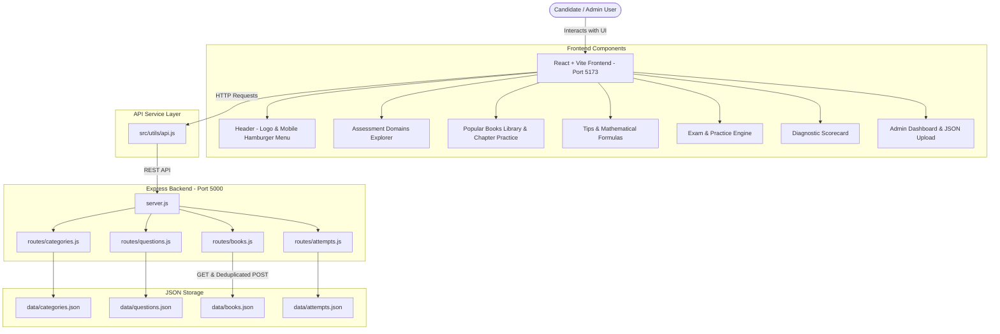

# BRAIN.md - Complete Technical Implementation & Knowledge Repository

Welcome to the **Brain Knowledge Repository** for the **APTIXA - National Placement Assessment Portal**. This document serves as the single source of truth detailing the full-stack architecture, formal enterprise UI design system, component hierarchies, backend REST API specifications (including CRUD admin endpoints & chapter upload system), data schemas, and operational instructions.

---

## 📑 Table of Contents
1. [System Overview & Capabilities](#system-overview--capabilities)
2. [Technology Stack](#technology-stack)
3. [Repository Directory Structure](#repository-directory-structure)
4. [Architecture & Data Flow](#architecture--data-flow)
5. [Formal Corporate UI Design System](#formal-corporate-ui-design-system)
6. [Component Hierarchy & Responsibilities](#component-hierarchy--responsibilities)
7. [Popular Books & Chapter Practice Module](#popular-books--chapter-practice-module)
8. [Express Backend REST API Specification](#express-backend-rest-api-specification)
9. [Admin Portal Management & JSON Upload Schema](#admin-portal-management--json-upload-schema)
10. [Data Models & Persistence Schema](#data-models--persistence-schema)
11. [How to Run & Operational Commands](#how-to-run--operational-commands)

---

## 1. System Overview & Capabilities

**APTIXA** is a full-stack, enterprise-grade web application engineered specifically for standardized Aptitude and Technical Evaluation (Campus Placements, GATE, CAT, Bank PO, and Corporate Hiring assessments).

### Core Capabilities:
- **📱 Fully Mobile Responsive Navigation Drawer**:
  - Top header features left-aligned APTIXA branding logo.
  - On mobile view (< 768px), navigation links gracefully collapse into an interactive **Hamburger Drawer Menu** (`Menu` / `X` icon).
- **📖 Popular Standard Reference Books Engine (`BooksSection.jsx`)**:
  - Chapter-by-chapter objective question bank extracted from standard competitive preparation books (e.g. *Quantitative Aptitude* by R.S. Aggarwal, *Logical Reasoning* by Arun Sharma).
  - Preserves exact book page citations and PDF page references for every question.
  - **Single Question View & All Questions List View**: Toggle between 1-question screen view and single-page continuous question list.
  - **Submit Chapter Test & Scorecard**: Instant evaluation engine calculating total score, accuracy %, correct/incorrect/unattempted breakdown, and diagnostic scorecard.
  - **Deduplication Safeguards**: Server-side normalization (`normalizeTitle`) preventing duplicate chapter creation on admin upload.
- **💡 Interactive Tips & Mathematical Formulas Hub (`TipsSection.jsx`)**:
  - Exam strategies, shortcut tricks, and interactive formula reference cards for Quantitative Aptitude, Logical Reasoning, and Data Interpretation.
- ** Dedicated Admin Portal (`AdminDashboard.jsx`)**:
  - Admin password security barrier (`APTIXA2026`).
  - Search & filter question bank repository.
  - Question CRUD: Create new questions, delete questions, and **Bulk Upload Chapter JSON Files** with automatic title deduplication.
- **Dual Assessment Engines**:
  - **Timed Exam Mode**: Countdown timer (90s/question), real-time Question Palette navigation sheet (Answered, Flagged, Unvisited, Active), strict exam controls, and diagnostic submission scorecard.
  - **Practice Mode**: Instant option validation, step-by-step mathematical & logical solution explanations, formula hints, and question bookmarking.

---

## 2. Technology Stack

- **Frontend**:
  - Framework: **React 18** (Vite build system)
  - Icons: **Lucide React**
  - Celebration Effects: **canvas-confetti**
  - Styling: **Formal Enterprise CSS Design System** (Light/Dark mode tokens, CSS custom properties, responsive breakpoints)
- **Backend**:
  - Engine: **Node.js**
  - Framework: **Express.js**
  - Middleware: **cors**, **express.json**
- **Data Persistence**:
  - JSON File Database (`server/data/questions.json`, `server/data/books.json`, `server/data/attempts.json`, `server/data/categories.json`) for zero-config local execution and persistent score tracking.

---

## 3. Repository Directory Structure

```
PLACEMENT/
├── BRAIN.md                           # Complete Technical Implementation Document (Single Source of Truth)
│
├── server/                            # Node.js + Express REST Backend
│   ├── package.json
│   ├── server.js                      # Express App Entry Point (Port 5000)
│   ├── data/
│   │   ├── categories.json            # Domain definitions & topics
│   │   ├── questions.json             # Seed question bank
│   │   ├── books.json                 # Standard reference books & chapters database
│   │   └── attempts.json              # Historical quiz submissions log
│   └── routes/
│       ├── categories.js              # GET /api/categories
│       ├── questions.js               # GET, POST, DELETE /api/questions
│       ├── books.js                   # GET /api/books, GET /api/books/:id/chapters/:chId, POST /api/books/upload
│       └── attempts.js                # POST /api/attempts, GET /api/attempts/stats
│
└── client/                            # React + Vite Frontend
    ├── package.json
    ├── index.html
    ├── vite.config.js
    └── src/
        ├── main.jsx                   # React entry point
        ├── index.css                  # Enterprise CSS Tokens & Responsive Breakpoints
        ├── App.jsx                    # Root Router & Navigation Controller
        ├── utils/
        │   ├── api.js                 # API service layer (Communicates with localhost:5000)
        │   └── timer.js               # Clock formatting utilities
        └── components/
            ├── Header.jsx             # Top Navbar with Left APTIXA Logo & Mobile Hamburger Menu
            ├── CategoryCard.jsx       # Domain Cards with Quick Launch
            ├── BooksSection.jsx       # Standard Books Library, Chapter Practice & Evaluation Scorecard
            ├── TipsSection.jsx        # Exam Tips & Interactive Formulas Hub
            ├── QuestionPalette.jsx    # Exam mode right-hand question sheet
            ├── QuizRunner.jsx         # Interactive Exam & Practice Mode engine
            ├── QuizResult.jsx         # Diagnostic Scorecard & Solution Key Accordion
            ├── PerformanceStats.jsx   # Analytics dashboard & score history table
            ├── AdminLogin.jsx         # Admin Password Security Modal
            └── AdminDashboard.jsx     # Admin Portal (Question CRUD & JSON Book Upload)
```

---

## 4. Architecture & Data Flow



---

## 5. Formal Corporate UI Design System

The platform strictly adheres to a formal corporate aesthetic (HackerRank / LeetCode style) with dual White & Black theme modes:

### Color System Tokens:
- **Corporate Light Mode (White)**: Clean white `#ffffff` cards, soft neutral background `#f8fafc`, dark navy primary `#2563eb`, slate text `#0f172a`, subtle borders `#e2e8f0`.
- **Corporate Dark Mode (Black)**: Dark slate `#0b0f17` backdrop, `#18202e` card containers, sharp gray borders `#273449`, high-contrast text `#f8fafc`.

---

## 6. Popular Books & Chapter Practice Module

The **Popular Books** module enables learners to practice extracted textbook questions chapter by chapter:

- **Library Explorer**: Displays reference books (e.g. R.S. Aggarwal's *Quantitative Aptitude*) with total question counts and chapter indices.
- **Chapter Runner**: Supports both **1 Question View** and **All Questions List View**.
- **Interactive Question Cards**: Options A, B, C, D with clear hover/selected/correct/wrong visual feedback, book page numbers, and optional direction context.
- **Chapter Test Evaluation Scorecard**: Calculates accuracy %, score percentage, correct/wrong counts, and unattempted count upon test submission.

---

## 7. Express Backend REST API Specification

### 1. Categories Endpoint
- `GET /api/categories` - Returns domain categories enriched with `questionCount`.

### 2. Questions Endpoints
- `GET /api/questions` - Returns filtered questions (`category`, `difficulty`, `search`, `limit`).
- `POST /api/questions` - Creates a single question in `questions.json`.
- `DELETE /api/questions/:id` - Deletes a question from `questions.json`.

### 3. Books & Chapters Endpoints
- `GET /api/books` - Returns list of reference books and chapter metadata.
- `GET /api/books/:bookId/chapters/:chapterId` - Returns specific chapter questions with robust title/ID matching.
- **`POST /api/books/upload`** - Bulk upload chapter questions JSON. Normalizes chapter titles using `normalizeTitle` to append new questions to existing chapters without creating duplicates.

### 4. Attempts Endpoints
- `POST /api/attempts` - Stores test attempt result.
- `GET /api/attempts/stats` - Returns aggregate statistics and historical attempts log.

---

## 8. Admin Portal & JSON Upload Schema

Admin users can upload chapters using JSON in the following format:

```json
{
  "book": "Quantitative Aptitude for Competitive Examinations — R.S. Aggarwal",
  "chapter": "1. Number System",
  "question_count": 380,
  "description": "Extracted objective-type questions, options, and answer key from the first chapter.",
  "questions": [
    {
      "id": "number-system-001",
      "chapter": "Number System",
      "question_number": 1,
      "question": "What is the place value of 5 in 3254710? (CLAT, 2010)",
      "options": {
        "a": "5",
        "b": "10000",
        "c": "50000",
        "d": "54710"
      },
      "correct_option": "c",
      "answer": "50000",
      "book_page": 14,
      "pdf_page": 23
    }
  ]
}
```

---

## 9. How to Run & Operational Commands

### Start Express Backend (Port 5000):
```bash
cd server
npm install
node server.js
```

### Start React + Vite Frontend (Port 5173):
```bash
cd client
npm install
npx vite --host 0.0.0.0 --port 5173
```

### Build Production App:
```bash
cd client
npm run build
```

---
*Maintained for APTIXA National Placement Assessment Portal.*
